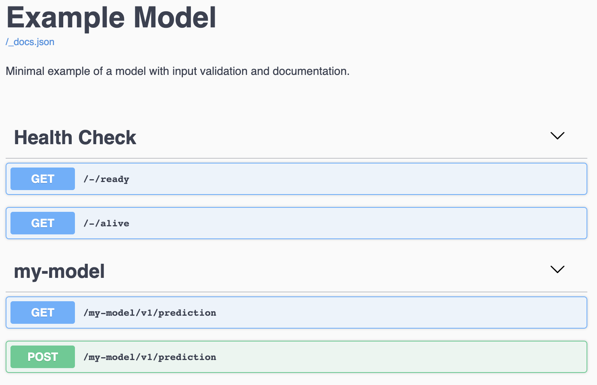
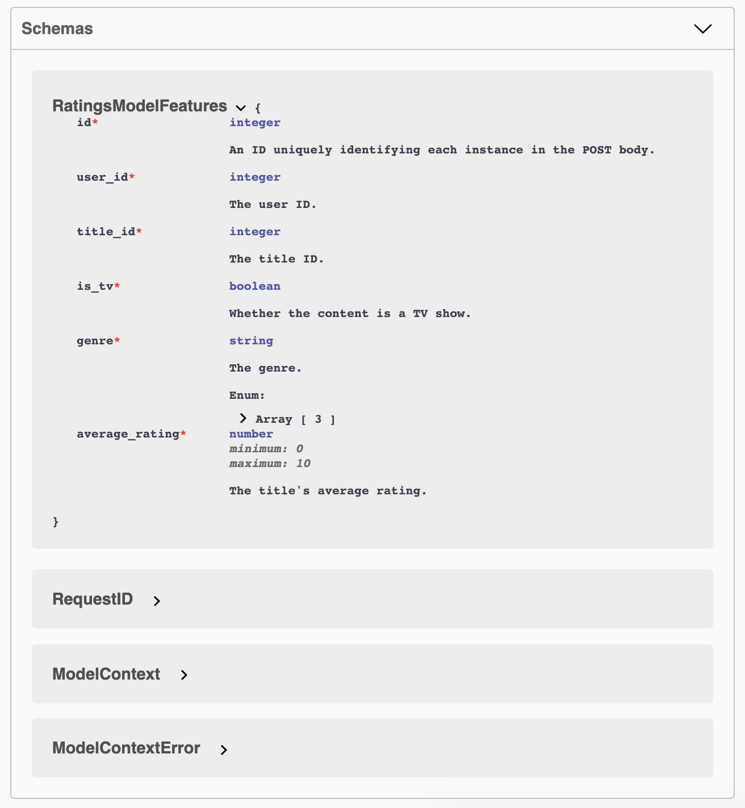
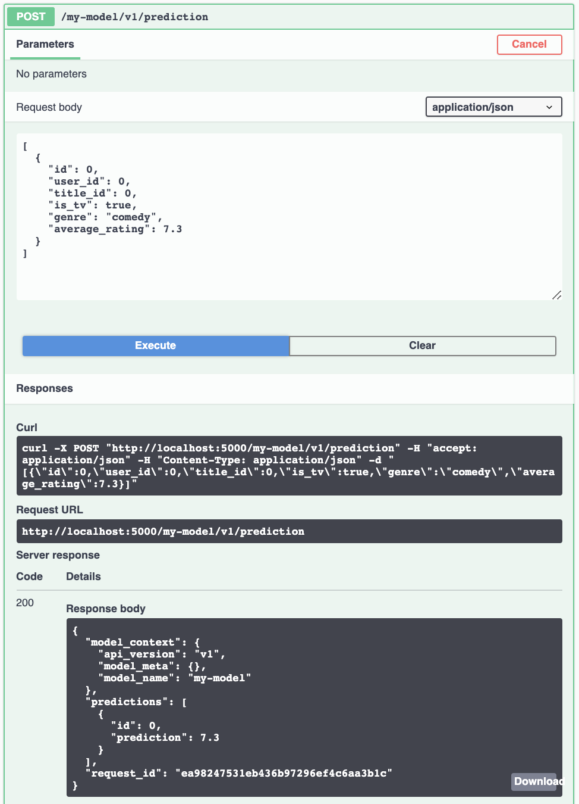

.. _openapi_schemas:

OpenAPI Schemas
===============

``porter`` provides support for automatically validating and documenting payload schemas.  Validation and documentation are built on a shared interface, guaranteeing that the documentation and models are  synchronized. For additional information, we recommend taking a look at :ref:`this script <contracts.py>` which contains several working examples.

.. note::

    Aside from a few exceptions such as `nullable`, ``porter`` currently validates data against OpenAPI schemas by leveraging `fastjsonschema <https://github.com/horejsek/python-fastjsonschema>`_. This implies that ``porter`` currently only supports the intersection of OpenAPI and `JSONSchema <https://json-schema.org/>`_ which is described `here <https://swagger.io/docs/specification/data-models/keywords/>`_.

    At the moment this is simply an implementation detail. Any changes in the future would provide more broad support for the OpenAPI spec.

Schema Definition
-----------------

``porter`` provides a Python interface to the `OpenAPI Specification <https://swagger.io/docs/specification/about/>`_.  Schema definition is facilitated by :mod:`porter.schemas`.  Valid data types include:

.. code-block:: python

    from porter.schemas import Boolean, Integer, Number, String, Array, Object

For each type, the first argument is an optional (but recommended) description.
Objects take a ``properties`` argument of type ``dict`` specifying the names and types of each nested element.  All types take an optional ``additional_params`` argument, also of type ``dict``, giving access to all other keys in the OpenAPI specification.

For example, the input expected by a :class:`porter.services.PredictionService` serving rating predictions might look like so:

.. code-block:: python

    feature_schema = Object(
        'Inputs to the ratings model',
        properties=dict(
            user_id=Integer('The user ID.'),
            title_id=Integer('The title ID.'),
            is_tv=Boolean('Whether the content is a TV show.'),
            genre=String('The genre.',
                         additional_params={'enum': ['comedy', 'action', 'drama']}),
            average_rating=Number('The title\'s average rating.',
                                  additional_params={'minimum': 0, 'maximum': 10}),
        ),
        reference_name='RatingsModelFeatures'
    )

This schema is equivalent to the following yaml markup:

.. code-block:: yaml

    - RatingsModelFeatures:
        type: object
        description: Inputs to the ratings model
        properties:
          user_id:
            type: integer
            description: The user ID.
          title_id:
            type: integer
            description: The title ID.
          is_tv:
            type: boolean
            description: Whether the content is a TV show.
          genre:
            type: string
            description: The genre.
            enum: [comedy, action, drama]
          average_rating:
            type: number
            description: The title's average rating.
            minimum: 0
            maximum: 10
        required: [average_rating, genre, is_tv, title_id, user_id]

:class:`PredictionService <porter.services.PredictionService>` adds a required integer field, ``id``, to the schema.  Also, by default, :class:`PredictionService <porter.services.PredictionService>` performs batch prediction over multiple objects, and thus the above would become the item type for an Array.  These modifications are roughly equivalent to:

.. code-block:: python

    instance_schema = Object(properties={'id': Integer(), **feature_schema.properties})
    batch_schema = Array(item_type=instance_schema)

resulting in the following OpenAPI spec which describes an acceptable payload for a :class:`PredictionService <porter.services.PredictionService>` instantiated with ``PredictionService(..., feature_schema=feature_schema)``

.. code-block:: yaml

    type: array
    items:
      type: object
      properties:
        average_rating:
          description: The title's average rating.
          maximum: 10
          minimum: 0
          type: number
        genre:
          description: The genre.
          enum:
          - comedy
          - action
          - drama
          type: string
        id:
          description: 'An ID uniquely identifying each instance in the POST body.'
          type: integer
        is_tv:
          description: Whether the content is a TV show.
          type: boolean
        title_id:
          description: The title ID.
          type: integer
        user_id:
          description: The user ID.
          type: integer
      required:
      - average_rating
      - genre
      - id
      - is_tv
      - title_id
      - user_id

Notice that here ``item_type`` is another API object type, in this case ``Object``.  Both :attr:`Array.item_type <porter.schemas.Array.item_type>` and :attr:`Object.properties <porter.schemas.Object.properties>` are composable in this way, and will be implemented using OpenAPI ``$ref`` if ``reference_name`` is given.

Schema Validation
-----------------

We can add input validation against the above schema to the :class:`PredictionService <porter.services.PredictionService>` in :ref:`getting_started` like so:

.. code-block:: python

    prediction_service = PredictionService(
        model=my_model,
        name='my-model',
        api_version='v1',
        feature_schema=feature_schema,
        validate_request_data=True)

Now, for valid input such as

.. code-block:: json

    [
        {
            "id": 1,
            "user_id": 122333,
            "title_id": 444455555,
            "is_tv": true,
            "genre": "comedy",
            "average_rating": 6.7
        },
        {
            "id": 2,
            "user_id": 122333,
            "title_id": 788999,
            "is_tv": false,
            "genre": "drama",
            "average_rating": 4.3
        }
    ]

we receive predictions as expected, but input such as

.. code-block:: json

    [
        {
            "id": 1,
            "user_id": 122333,
            "title_id": 444455555,
            "genre": "not-a-real-genre",
            "average_rating": 6.7
        },
    ]

will result in a 422 error (Unprocessable Entity).  Error handling is discussed further in :ref:`this section <error_handling>`.

.. _schema_documentation:

Schema Documentation
--------------------

To expose `Swagger <https://swagger.io/>`_ documentation automatically, simply add ``expose_docs=True`` to the :class:`porter.services.ModelApp` constructor.  ``porter`` will also set the ``name`` and ``description`` attributes, which will appear in the documentation.

.. code-block:: python

    app = ModelApp(
        [prediction_service],
        name='Example Model',
        description='Minimal example of a model with input validation and documentation.',
        expose_docs=True)

If this app is run in testing mode, docs are now available at ``http://localhost:5000/docs/``.  The top of the page shows the name and description of the app, followed by information about the exposed endpoints:

At the bottom of the page, we find a list of schemas which can be unfolded and inspected:

The endpoint documentation can be unfolded, and you can select "Try it out" to test it:

Accessing the OpenAPI Spec
--------------------------

The automatically generated OpenAPI spec used to render the Swagger documentation shown above can be
accessed directly from the :class:`porter.services.ModelApp` instance.

.. code-block:: python

    app = ModelApp(..., expose_docs=True)
    app.docs_json

This attribute is useful for programmatically inspecting the documentation. Additionally, users
may mutate this object (so long as it adheres to the OpenAPI standard), thereby overriding any
aspect of the OpenAPI spec served.
